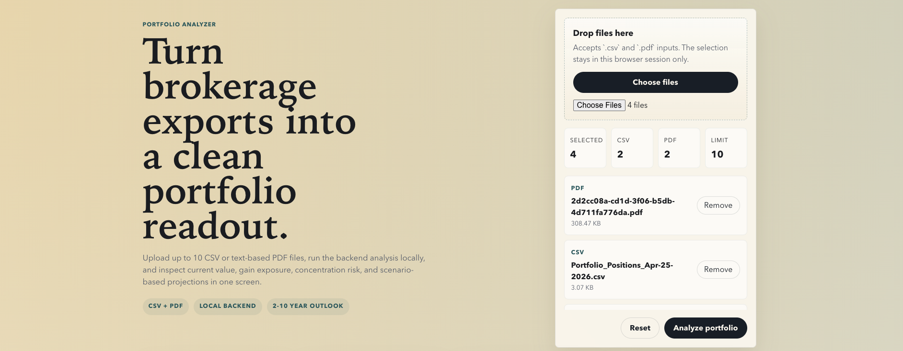

# Portfolio CSV and PDF Analyzer

Local-first portfolio analysis app for brokerage exports. Upload up to 10 CSV and text-based PDF files, send them to a local backend for parsing and aggregation, and explore the results in a browser dashboard with holdings insights, gain/loss breakdowns, and 1-10 year scenario projections.

## Stack

- Frontend: React, TypeScript, Vite, Recharts
- Backend: Node, Express, TypeScript
- Shared logic: TypeScript analysis helpers in `shared/`
- Tests: Vitest, Playwright

## Project Layout

- `frontend/` browser app
- `backend/` upload API and parsers
- `shared/` canonical types and pure analysis logic
- `test/fixtures/` local sample files for repeatable runs

## Screenshot


## Initial Repository Setup

From `Documents/Projects`:

```bash
mkdir -p portfolio-csv-analyzer portfolio-csv-analyzer-worktrees
cd portfolio-csv-analyzer
git init
git symbolic-ref HEAD refs/heads/main
git add .
git commit -m "Initial repository bootstrap"
git worktree add ../portfolio-csv-analyzer-worktrees/app -b feature/initial-build
```

If the repo already exists, use the worktree directly:

```bash
cd /Users/ps/Documents/Projects/portfolio-csv-analyzer-worktrees/app
```

## Install

```bash
cd /Users/ps/Documents/Projects/portfolio-csv-analyzer-worktrees/app
npm install
```

If your global npm cache is not writable, use a temporary cache:

```bash
npm install --cache /tmp/portfolio-csv-analyzer-npm-cache
```

## Run Locally

Start both apps together:

```bash
npm run dev
```

Expected local URLs:

- Frontend: `http://127.0.0.1:4173`
- Backend: `http://localhost:4177`

Run each side separately if needed:

```bash
npm run dev --workspace @portfolio/backend
npm run dev --workspace @portfolio/frontend
```

## Test

Run the unit and integration test suites:

```bash
npm test
```

Run frontend E2E tests:

```bash
npm run test:e2e
```

## Sample Files

- CSV fixture in repo: `test/fixtures/portfolio-sample.csv`
- You can upload local brokerage exports from your machine through the browser; test fixtures use synthetic values only.

## Product Notes

- Supports CSV plus text-based PDFs with extractable text
- Scanned or image-only PDFs are detected and reported as unsupported
- Uploads are processed in-memory only for the active session
- Projections are illustrative scenario bands, with a local S&P 500 historical-average tracker for comparison, not investment advice
